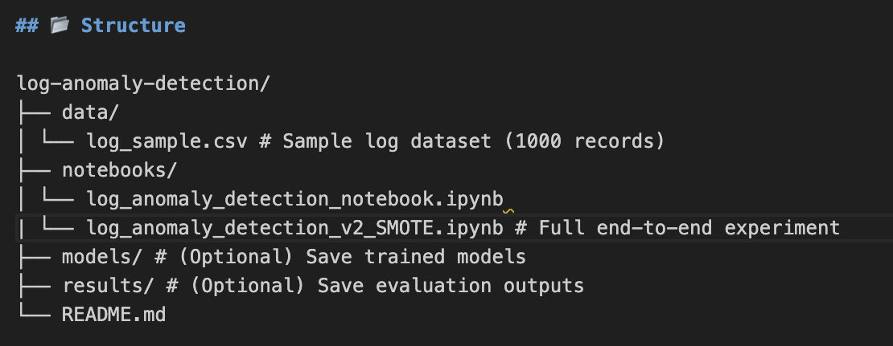
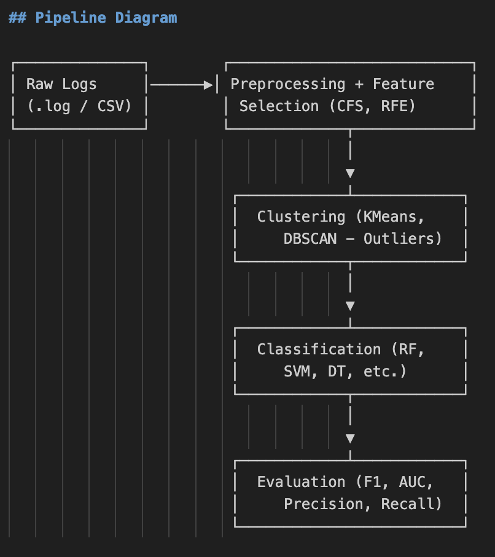

# Log-Based Anomaly Detection Framework

This project demonstrates a simple pipeline for detecting Denial-of-Service (DoS) attacks using a combination of clustering and classification techniques applied to simulated network log data.

This notebook demonstrates a full machine learning workflow for binary classification using the IoT Network Intrusion Dataset.

## Steps include:
 1. Importing necessary libraries and modules for data manipulation, preprocessing, modeling, and evaluation.
 2. Loading and cleaning the dataset, handling missing and infinite values.
 3. Separating features (X) and target (y), and identifying categorical and numerical columns.
 4. Building a preprocessing pipeline using ColumnTransformer for scaling and encoding.
 5. Splitting the data into training and testing sets.
 6. Creating a pipeline that includes preprocessing, SMOTE for balancing, feature selection, and XGBoost classifier.
 7. Training the model and evaluating its performance using classification metrics, ROC-AUC, and visualizations.
 8. Performing cross-validation to assess model generalization.

## 📂 Structure


log-anomaly-detection/
├── data/
│ └── log_sample.csv # Sample log dataset (1000 records)
├── notebooks/
| └── hazem-code.ipynb                     # Ver 03 final run notebook
│ └── log_anomaly_detection_notebook.ipynb # Ver 01
| └── log_anomaly_detection_v2_SMOTE.ipynb # Ver 02
└── README.md


## 🚀 How it Works

1. **Load and Preprocess Logs**:
   - Standardize `.log` data into structured `.csv`
   - Encode categorical fields (e.g., protocol, flags)
   - Normalize features

2. **Unsupervised Clustering (K-Means)**:
   - Detect anomalies without labels
   - Flag outliers as potentially malicious

3. **Supervised Classification (Random Forest)**:
   - Train model on labeled samples
   - Evaluate using metrics: Accuracy, Precision, Recall, ROC-AUC

4. **Output**:
   - Confusion Matrix, Classification Report, ROC Score

## 📊 Evaluation Metrics

- Accuracy
- Precision / Recall / F1 Score
- ROC AUC
- Confusion Matrix

## Pipeline Diagram

┌──────────────┐        ┌───────────────────────────┐
│ Raw Logs     │──────▶│ Preprocessing + Feature    │
│ (.log / CSV) │        │ Selection (CFS, RFE)      │
└──────────────┘        └─────────────┬─────────────┘
                                      │
                                      ▼
                         ┌────────────┴────────────┐
                         │  Clustering (KMeans,    │
                         │     DBSCAN - Outliers)  │
                         └────────────┬────────────┘
                                      │
                                      ▼
                         ┌────────────┴────────────┐
                         │  Classification (RF,    │
                         │     SVM, DT, etc.)      │
                         └────────────┬────────────┘
                                      │
                                      ▼
                         ┌────────────┴────────────┐
                         │  Evaluation (F1, AUC,   │
                         │     Precision, Recall)  │
                         └─────────────────────────┘

## ⚙️ Requirements

Install dependencies with:

```bash
pip install pandas numpy scikit-learn matplotlib seaborn jupyter

